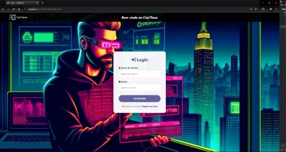
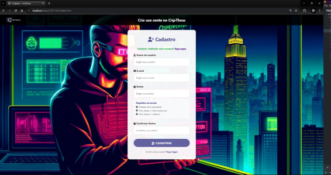
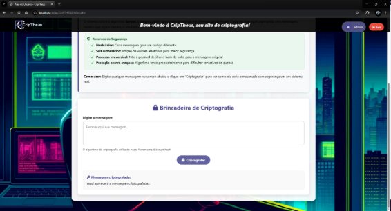
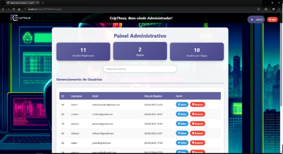

**Plataforma web PHP/MySQL com arquitetura MVC implícita, implementando:**

- Autenticação segura com bcrypt e sessões
- Painel administrativo com CRUD de usuários
- Módulo interativo de hashing de mensagens
- Frontend responsivo com CSS Flexbox/Grid
- Organização em camadas (frontend/backend)
- Validações client-side e server-side"

Destaques:

- 🔒 **Segurança**: Bcrypt para senhas e sessões protegidas
- 📱 **Responsividade**: Layout adaptável para mobile/desktop
- ⚙️ **Funcionalidades**: Autenticação, CRUD, criptografia interativa
- 🧩 **Tecnologias**: PHP, MySQL, HTML5, CSS3, JavaScript.

Telas:

### Tela de Login

### Tela de Registro  

### Tela do Usuário Comum

### Tela do Administrador

## 🛠️ Tecnologias Utilizadas
- 
- 
- 
- 
- 

